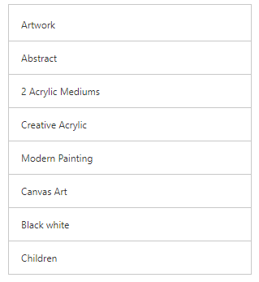
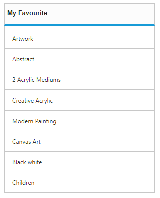

# Getting Started

The **ListView** widget builds an interactive list view interface. This control allows you to select an item from a list-like interface and provides the infrastructure to display a set of data items in different layouts or views. Lists display data, data navigation, result lists, and data entry.
Before going to getting started with ListView please refer [Getting Started with Syncfusion EmberJS application](https://help.syncfusion.com/emberjs/overview/)  to know how to create simple Essential EmberJS application.
If you want to know individual script reference to create ListView Please Refer under [Requires](https://help.syncfusion.com/api/js/ejlistview/)

## Create a simple ListView



        

               {{#ej-listview id="defaultListview" e-width=model.width}}
						<ul>
                            <li data-ej-text="Artwork"></li>
                            <li data-ej-text="Abstract"></li>
                            <li data-ej-text="2 Acrylic Mediums"></li>
                            <li data-ej-text="Creative Acrylic"></li>
                            <li data-ej-text="Modern Painting"></li>
                            <li data-ej-text="Canvas Art"></li>
                            <li data-ej-text="Black white"></li>
                            <li data-ej-text="Children"></li>
                        </ul>
			   {{/ej-listview}}
            



Please add the following code in corresponding script file,

    

        export default Ember.Route.extend({
        model(){
           return {
                width: "300"  
            } }
        });

    

Run the above code to render the following output.

 

**Add Header** 

You can add a header for **ListView**. Refer to the following script.

 

        

               {{#ej-listview id="defaultListview" e-width=model.width e-showHeader=true e-headerTitle="My Favourite"}}
						<ul>
                            <li data-ej-text="Artwork"></li>
                            <li data-ej-text="Abstract"></li>
                            <li data-ej-text="2 Acrylic Mediums"></li>
                            <li data-ej-text="Creative Acrylic"></li>
                            <li data-ej-text="Modern Painting"></li>
                            <li data-ej-text="Canvas Art"></li>
                            <li data-ej-text="Black white"></li>
                            <li data-ej-text="Children"></li>
                        </ul>
			   {{/ej-listview}}
            

    

Please add the following code in corresponding script file,

    

        export default Ember.Route.extend({
        model(){
        return {
                width: "300" 
            }
            }
        });

    

Run the above code to render the following output.

 

