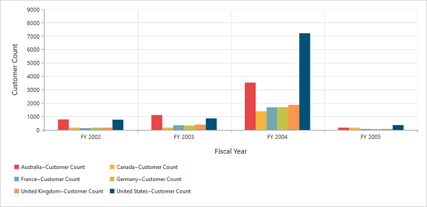

# Legend

## Legend Visibility

You can enable or disable legend using the `visible` property inside the `legend` object.

N> By default, the legend is visible in PivotChart.




	

	
	{{ej-pivotchart id="PivotChart" e-legend=model.legend }}
	
	





import Ember from 'ember';

export default Ember.Route.extend({
   model(){
    return {
                //...
                
                legend: {
					visible: true
				},
        }
    }
});





 

## Legend Shape

You can customize the legend `shape` in PivotChart control. Default value of legend shape is “rectangle”. Following legend shapes that are supported:

* rectangle
* circle
* cross
* diamond
* pentagon
* hexagon
* star
* ellipse
* triangle etc.



import Ember from 'ember';

export default Ember.Route.extend({
   model(){
    return {
                //...
                
                legend: {
					visible: true, 
                    shape: "Star" 
				},
        }
    }
});



 

## Legend Position

By using the `position` property, you can place the legend at top, bottom, left or right of the PivotChart. 

N> Default value of legend position is "bottom" in PivotChart.



import Ember from 'ember';

export default Ember.Route.extend({
   model(){
    return {
                //...
                
                legend: {
					visible: true, 
                    shape: "Star", 
                    position: "top"
				},
        }
    }
});



 

## Legend Title

To add the legend title, you have to specify the title text in `title.text` property.



import Ember from 'ember';

export default Ember.Route.extend({
   model(){
    return {
                //...
                
                legend: {
					visible: true, 
                    title:{ text: "Countries" }
				},
        }
    }
});



 

## Legend Alignment

You can align the legend to center, far and near based on its position in the Chart area using the `alignment` option.
 


import Ember from 'ember';

export default Ember.Route.extend({
   model(){
    return {
                //...
                
                legend: {
					visible: true, 
                    alignment: "Near"
				},
        }
    }
});



## Legend Items - Size and Border

By using the legend `itemStyle.width`, `itemStyle.height` and `itemStyle.border` properties, you can change the legend items - size and border.



import Ember from 'ember';

export default Ember.Route.extend({
   model(){
    return {
                //...
                
                legend: {
					visible: true,
                    itemStyle:
                    {
                        height: 12,
                        width: 12,
                        border:
                        {
                            color: 'magenta',
                            width: 1.5
                        }
                    } 
				},
        }
    }
});



 
## Legend Border

By using the `border` option in legend, you can customize border color and width.



import Ember from 'ember';

export default Ember.Route.extend({
   model(){
    return {
                //...
                
                legend: {
					visible: true, 
                    border:{
                        color: "#FFC342",
                        width: 2
                    }
				},
        }
    }
});



## Legend Text

By using the `font` option, you can customize the font family, font style, font weight and size of the legend text. 



import Ember from 'ember';

export default Ember.Route.extend({
   model(){
    return {
                //...
                
                legend: {
					visible: true, 
                    font:
                    {
                        fontFamily: 'Segoe UI',
                        fontStyle: 'italic',
                        fontWeight: 'bold',
                        size: '13px'
                    }
				},
        }
    }
});



