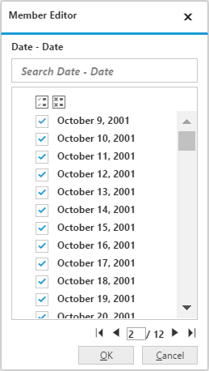

# Member Editor Paging

I> This feature is applicable for OLAP data source only.

Member editor paging helps to improve the rendering performance of the dialog by dividing large amount of data into sections and displaying them.

You can enable member editor paging and set member editor page size in PivotClient control by setting the `e-enableMemberEditorPaging` and `e-memberEditorPageSize` properties.


	

	
	{{ej-pivotclient id="PivotClient" e-enableMemberEditorPaging=model.enableMemberEditorPaging e-memberEditorPageSize=model.memberEditorPageSize }}
	
	





import Ember from 'ember';

export default Ember.Route.extend({
   model(){
    return {
            dataSource: {
                                data: "//bi.syncfusion.com/olap/msmdpump.dll", //data
                                catalog: "Adventure Works DW 2008 SE",
                                cube: "Adventure Works",
                                rows: [
                                    {
                                        fieldName: "[Date].[Fiscal]"
                                    }
                                ],
                                columns: [
                                    {
                                        fieldName: "[Product].[Product Categories]"
                                    }
                                ],
                                values: [
                                    {
                                        measures: [
                                            {
                                                fieldName: "[Measures].[Internet Sales Amount]",
                                            },
                                            {
                                                fieldName: "[Measures].[Growth in Customer Base Trend]"
                                            }, 
                                            {
                                                fieldName: "[Measures].[Growth in Customer Base Status]"
                                            }
                                        ],
                                        axis: "columns"
                                    }
                                ]
                            },
                            enableMemberEditorPaging: true,
                            memberEditorPageSize: 100
        }
    }
});



Following are the navigation option available in Member Editor Pager.
* Move First - Navigates to the first page.
* Move Previous - Navigates to the previous page from the current page.
* Move Next - Navigates to the next page from the current page.
* Move Last - Navigates to the last page.
* Numeric Box - Navigates to the desired page by entering an appropriate page number in numeric value.

