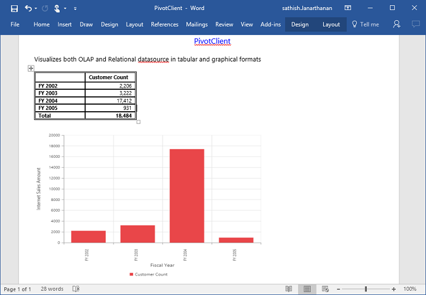

# Exporting

The pivot chart and the pivot grid in the pivot client widget can be exported to Microsoft Excel, Microsoft Word, and PDF documents by clicking the respective toolbar icons.

 

Exporting feature provides an option that allows you to export the pivot chart or pivot grid or both with the use of the `e-clientExportMode` property.

The `e-clientExportMode` property takes any one of the following values:

* **ChartAndGrid** – Exports both the pivot chart and pivot grid controls. This mode is the default mode.
* **ChartOnly** – Exports the pivot chart control alone.
* **GridOnly** – Exports the pivot grid control alone.

## JSON export

I> By default, exporting is done with the use of JSON records maintained in the client-side for both client and server modes.

To perform exporting with the use of a custom service method, the service containing the exporting method is hosted and its link is given in a URL as shown below. Without giving any value to the 'url' property, it takes the default exporting service link.


	

	
	{{ej-pivotclient id="PivotClient" e-clientExportMode=model.clientExportMode e-beforeExport=model.beforeExport}}
	
	





import Ember from 'ember';

export default Ember.Route.extend({
   model(){
    return {
            //...
            
            clientExportMode: ej.PivotClient.ClientExportMode.ChartAndGrid,
            beforeExport: function (args) {
                args.url = "http://js.syncfusion.com/ejservices/api/PivotClient/Olap/Export";//Exporting url can be modified here
            }
        }
    }
});



### Customize the export document name

The name of the document can be customized. The following code sample illustrates this process:


	

	
	{{ej-pivotclient id="PivotClient" e-clientExportMode=model.clientExportMode e-beforeExport=model.beforeExport}}
	
	





import Ember from 'ember';

export default Ember.Route.extend({
   model(){
    return {
            //...
            
            clientExportMode: ej.PivotClient.ClientExportMode.ChartAndGrid,
            beforeExport: function (args) {
                args.url = "http://js.syncfusion.com/ejservices/api/PivotClient/Olap/Export";//Exporting url can be modified here
                args.fileName="File name is customized here";
            }
        }
    }
});



## Pivot chart - Exporting format

I> This option is applicable only for the pivot chart in the pivot client specifically when exporting to Excel document.

You can set an option to export pivot chart to an Excel document, and you can export it as either an image or pivot chart format itself by setting the Boolean property `exportChartAsImage` in the `e-beforeExport` event.

N> By default, the pivot chart will be exported to image format in the Excel document.


	

	
	{{ej-pivotclient id="PivotClient" e-clientExportMode=model.clientExportMode e-beforeExport=model.beforeExport}}
	
	





import Ember from 'ember';

export default Ember.Route.extend({
   model(){
    return {
            //...
            
            clientExportMode: ej.PivotClient.ClientExportMode.ChartOnly,
            beforeExport: function (args) {
                args.url = "http://js.syncfusion.com/ejservices/api/PivotClient/Olap/Export";//Exporting url can be modified here
                args.exportChartAsImage = false; //You can set the chart format here
            }
        }
    }
});



The following screenshot shows the control exported to an Excel document showing its own format (pivoting chart).

## Exporting customization

You can add title and description to the exporting document by using the title and description properties respectively obtained in the `e-beforeExport` event. Similarly, you can enable or disable styling on the exported document by using the `exportWithStyle` property.


	

	
	{{ej-pivotclient id="PivotClient" e-clientExportMode=model.clientExportMode e-beforeExport=model.beforeExport}}
	
	





import Ember from 'ember';

export default Ember.Route.extend({
   model(){
    return {
            //...
            
            clientExportMode: ej.PivotClient.ClientExportMode.ChartOnly,
            beforeExport: function (args) {
                args.url = "http://js.syncfusion.com/ejservices/api/PivotClient/Olap/Export";
                args.title = "PivotClient";
                args.description = "Visualizes both OLAP and Relational datasource in tabular and graphical formats";
    			args.exportWithStyle = true;   // by default it sets as true. It improves performance on exporting huge data when it sets as false.
            }
        }
    }
});



### Exporting complete data on Paging

When paging is enabled, you can export the complete data by enabling the `e-enableCompleteDataExport` property. It is applicable for all kinds of exporting formats available in PivotClient.


	

	
	{{ej-pivotclient id="PivotClient" e-enableCompleteDataExport=model.enableCompleteDataExport }}
	
	





import Ember from 'ember';

export default Ember.Route.extend({
   model(){
    return {
            //...
            
            enableCompleteDataExport: true
        }
    }
});



The following screenshot shows the pivot grid and pivot chart controls exported to an Excel document:

The following screenshot shows the pivot grid and pivot chart controls exported to a Word document:

The following screenshot shows the pivot grid and pivot chart controls exported to a PDF document:

